# Лабораторні роботи 7, 8 та 9 на теми "Дослідження бойлерплейту фронтенд-додатку" та "Full-stack інтеграція: розробка UI на базі професійного бойлерплейту"
## Виконав: *Віктор Биков з групи ІПЗ 3.03*

### Опис проекту
Цей проект є демонстрацією використання бойлерплейту фронтенд-додатку для створення сучасного веб-інтерфейсу. Він включає в себе налаштування середовища розробки, інтеграцію з бекендом та розробку користувацького інтерфейсу.

### Реалізований функціонал
Данний фронтенд-проект дозволяє переглядати, додавати та видаляти записи, а також редагувати вже існуючі, з трьох пов'язаних сутностей інформаційної системи Комп'ютерного клубу, а саме:
- Клієнти
- Комп'ютери
- Сеанси

### Приклади ключового коду
**Кофігурація Axios:**

```javascript
import axios from 'axios';

// Створення окремого інстансу Axios
const apiClient = axios.create({
  baseURL: import.meta.env['VITE_API_BASE_URL'],
  headers: {
    'Content-Type': 'application/json',
  },
});

// Інтерцептор для відповіді (обробка помилок)
apiClient.interceptors.response.use(
  (response) => response,
  (error) => {
    console.error('API Error:', error.response?.data || error.message);
    return Promise.reject(error);
  }
);
export default apiClient;
```

**Хук для TanStack Query:**

```javascript
import { useQuery, UseQueryOptions, UseQueryResult } from '@tanstack/react-query';
import toast from './toast';

/**
 * useAppQuery — обгортка над useQuery для уніфікованої обробки помилок
 */
export const useAppQuery = <TData = unknown, TError = unknown, TQueryKey extends readonly unknown[] = readonly unknown[]>(
  options: UseQueryOptions<TData, TError, TData, TQueryKey>
): UseQueryResult<TData, TError> => {
  // treat options as any to avoid mismatches between different react-query overload typings
  const raw = options as any;
  const wrappedOptions = {
    ...raw,
    onError: (err: unknown) => {
      const msg = (err as any)?.message || 'Сталася помилка при завантаженні даних';
      toast.error(String(msg));
      if (raw && raw.onError) {
        raw.onError(err);
      }
    },
  } as UseQueryOptions<TData, TError, TData, TQueryKey>;

  return useQuery<TData, TError, TData, TQueryKey>(wrappedOptions as any);
};

export default useAppQuery;
```

**Схема Zod:**

```javascript
import { z } from 'zod';

export const ClientSchema = z.object({
  phone: z.string()
    .min(1, 'Phone is required')
    .regex(/^[\d\s\-\+\(\)]+$/, 'Phone must contain only numbers and valid characters'),
  full_name: z.string().min(1, 'Full name is required').min(2, 'Name must be at least 2 characters'),
  birth: z.string().refine(val => !isNaN(Date.parse(val)), 'Invalid date format'),
  sessions: z.array(z.object({
    session_id: z.number(),
    Time: z.string(),
    Duration: z.union([
      z.string(),
      z.object({ hours: z.number().nonnegative().optional(), minutes: z.number().nonnegative().optional(), seconds: z.number().nonnegative().optional() })
    ]),
    Cost: z.union([
      z.number(),
      z.string(),
      z.object({ amount: z.number().optional(), value: z.number().optional(), currency: z.string().optional() })
    ]),
    pc_id: z.number(),
  })).optional(),
});

export const ClientCreateSchema = ClientSchema;
export const ClientUpdateSchema = ClientSchema.partial();

export type Client = z.infer<typeof ClientSchema>;
export type ClientCreate = z.infer<typeof ClientCreateSchema>;
export type ClientUpdate = z.infer<typeof ClientUpdateSchema>;
```

### Скріншоти демонстрації роботи додатку

**Головна строрінка зі списком сутностей:**


**Сторінка з таблицею певної сутності (на прикладі ПК):**

*Завантаження:*

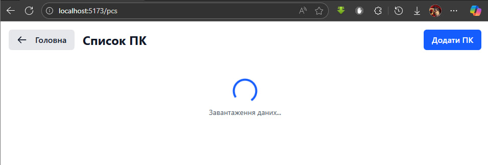

*Відсутність з'єднання (не запустили сервер):*

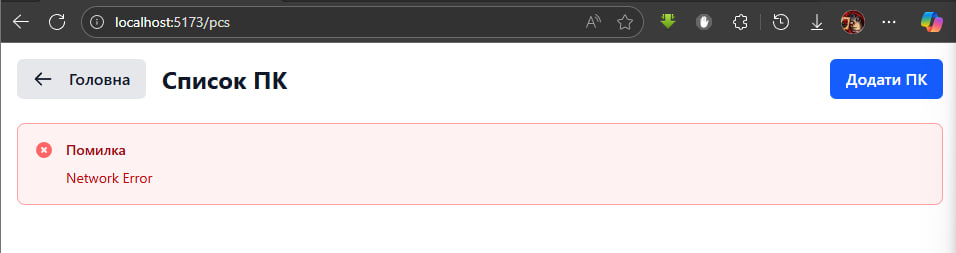

*Порожня таблиця (відсутні записи):*

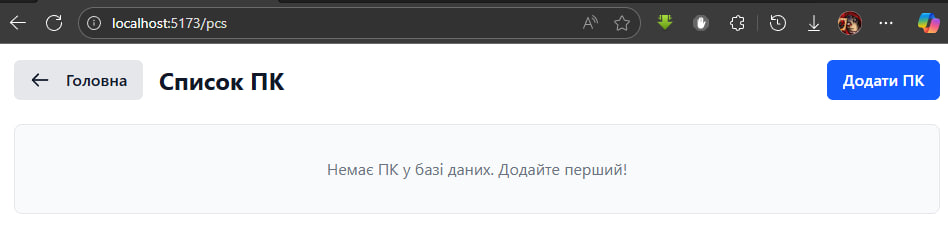

*Таблиця з записами:*


**Форми створення, редагування та видалення записів:**

*Форма створення ПК:*

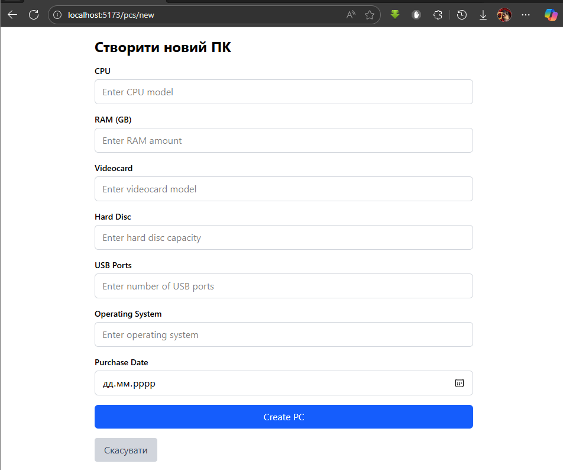

*З помилками:*


*Форма редагування ПК:*

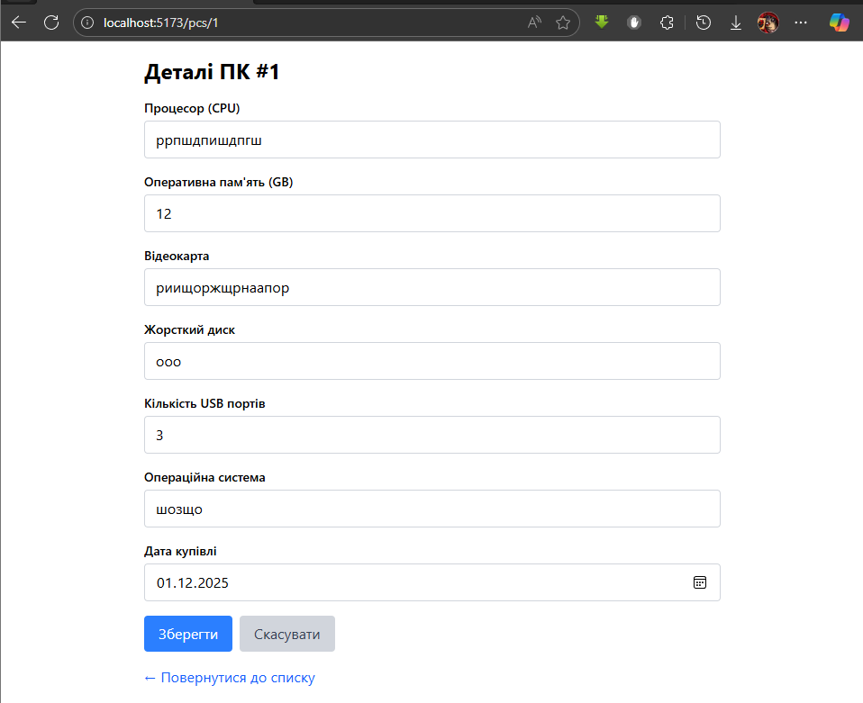

*Видалення ПК з підтвердженням:*

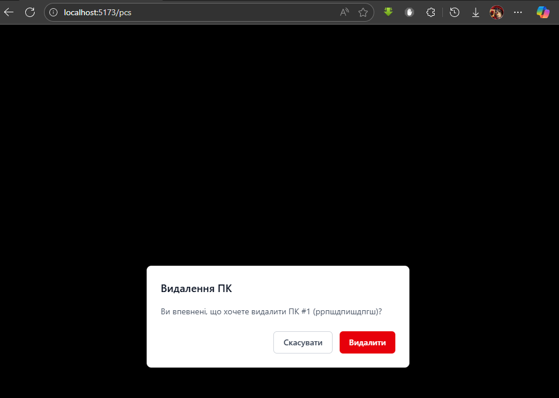

*Форма створення Клієнта:*

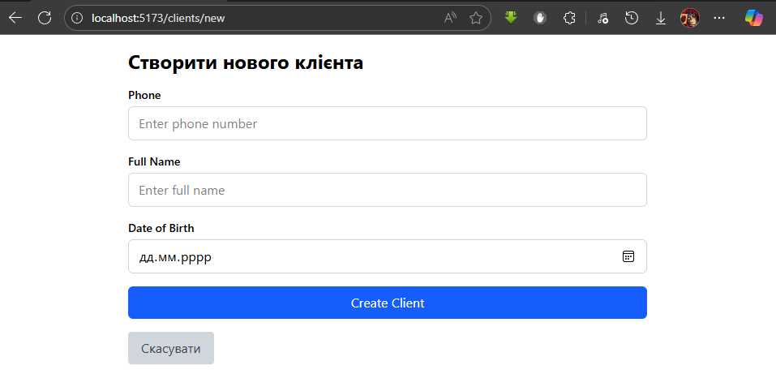

*З помилками:*

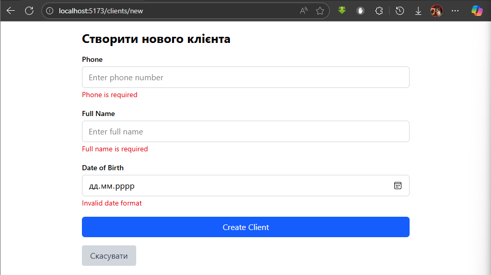

*Форма редагування Клієнта:*

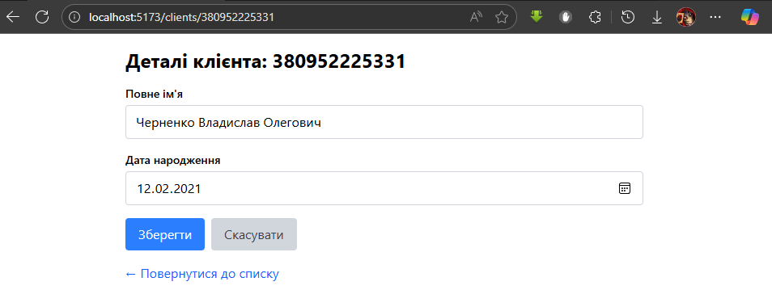

*Видалення Клієнта з підтвердженням:*

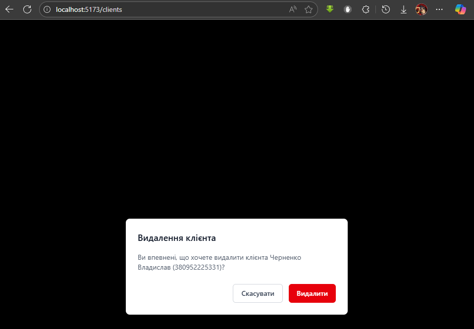

*Форма створення Сеансу:*

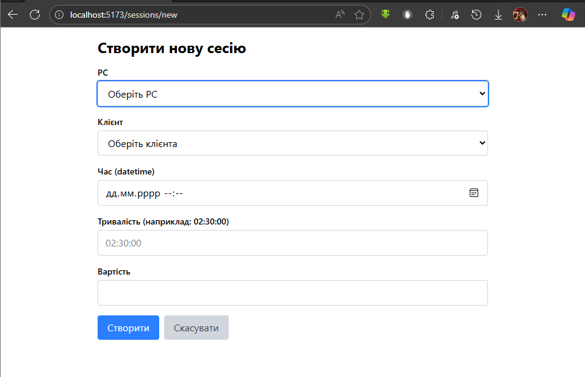

*З помилками:*

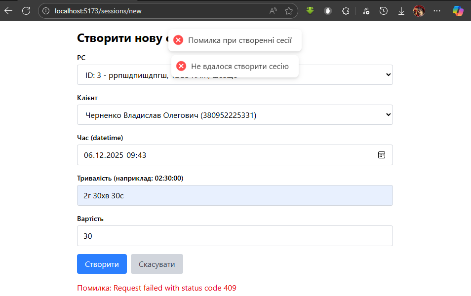

*Форма редагування Сеансу:*

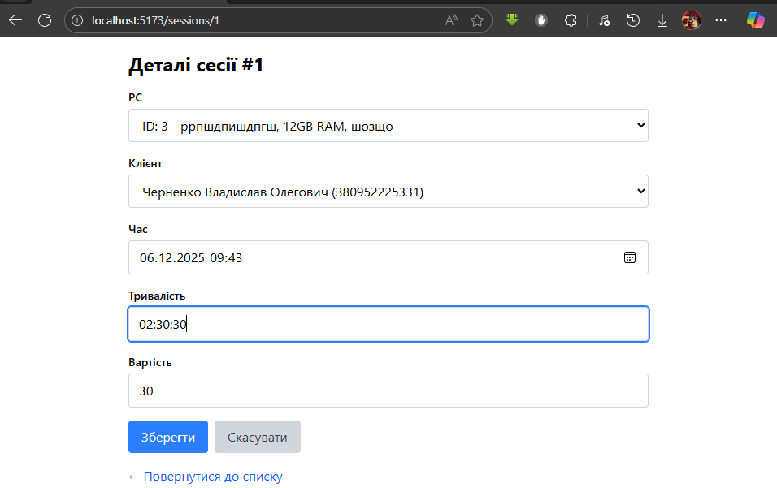

*Видалення Сеансу з підтвердженням:*

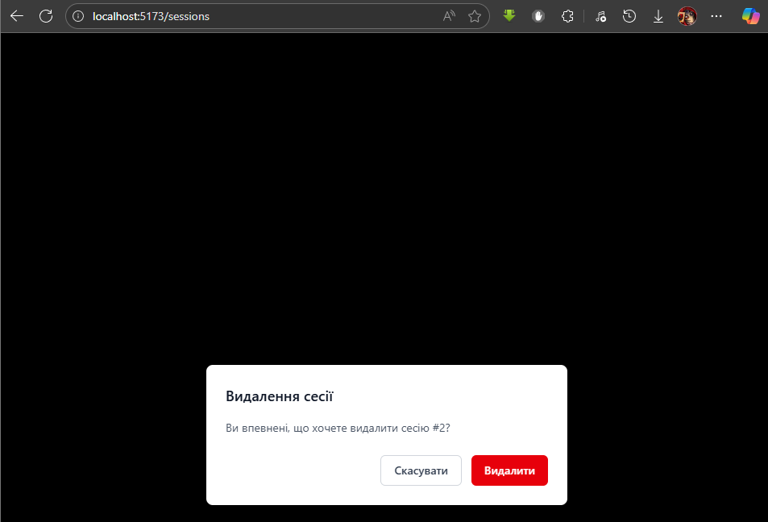

**Вкладка Network у DevTools:**

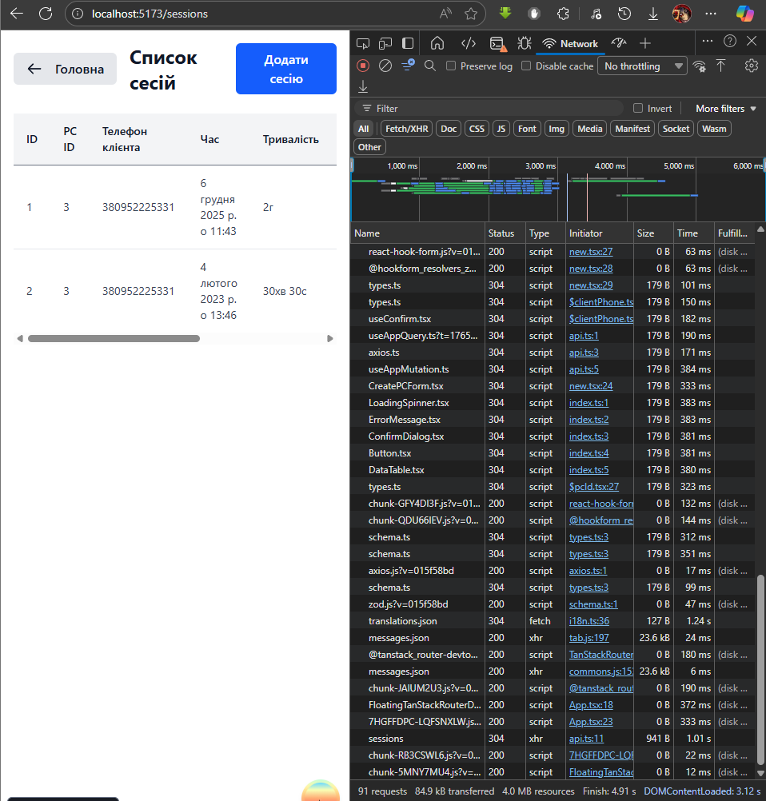

### Додаткові коментарі
В процесі виконання було використано велику кількість технологій та бібліотек, які хотілося б у майбутньому дослідити кожну окремо та детальніше. Серед проблем, які траплялись при реалізації проекту, можна виділити складнощі при конвертації певнихх форматів даних (наприклад, Duration та Cost) для їх коректного відображення або передавання назад до бекендної частини. В результаті функції таких конвертацій було виокремлено в окремі файли у папці utils.
